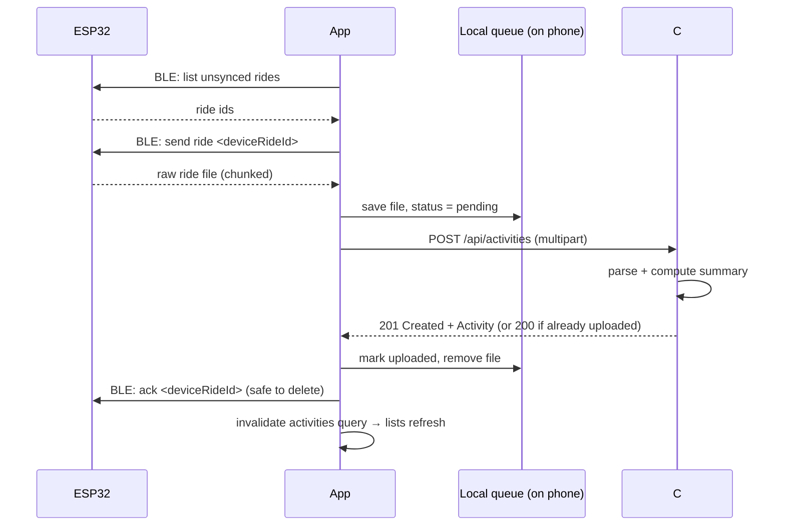

# Bike Computer App — Details

The companion mobile app for the ESP32 bike computer. Riders sync rides from the device and review them on their phone. The app is built with **Expo SDK 57 / React Native 0.86 / Expo Router** in TypeScript, and the backend is in **C#**.

At the moment the app runs entirely on **mock data**. This document covers:

1. [Running the app](#1-running-the-app)
2. [Project structure](#2-project-structure)
3. [Backend API contract](#3-backend-api-contract): what the C# API needs to return
4. [Wiring the backend into the app](#4-wiring-the-backend-into-the-app)
5. [Ride sync flow](#5-ride-sync-flow): device → app → backend → app
6. [Notes for further development](#6-notes-for-further-development)

---

## 1. Running the app

We use **development builds, not Expo Go**. The app will need Bluetooth to talk to the bike computer, and Expo Go can't load custom native modules like a BLE library.

```bash
cd BikeComputerApp
npm install
npx expo run:ios        # builds the native app with Xcode, installs it on the iOS simulator, starts Metro
npx expo run:android    # same for Android (needs Android Studio / an emulator)
```

- **Requirements (iOS):** a Mac with Xcode, at least one iOS simulator, and CocoaPods (installed automatically by the Expo CLI when needed).
- **Device:** to run on a physical iPhone, use `npx expo run:ios --device`. That requires an Apple developer account and code signing set up in Xcode.
- **When to rebuild:** only after **native** changes, i.e. a newly added package with native code, `app.json` / config plugin edits, or an SDK upgrade. JS/TS changes reload through Metro without a rebuild.
- **Recommended next step:** add `expo-dev-client` (`npx expo install expo-dev-client`). It gives the dev build a launcher and dev menu, makes `npx expo start` target the dev build instead of Expo Go, and is needed for `eas build --profile development` builds teammates can install.
- **Web:** `npx expo start --web` still works for quick UI checks, but it can't exercise Bluetooth or other native features.

`ios/` and `android/` are **generated** by `run:ios` / `run:android` (Continuous Native Generation) and git-ignored. Don't edit them by hand: native configuration goes in `app.json` or config plugins. If they get into a bad state, delete them, or run `npx expo prebuild --clean`, and rebuild.

Checks to run before committing:

```bash
npx tsc --noEmit        # typecheck
npx expo lint           # lint
npx expo-doctor         # dependency / config health
```

Add dependencies with `npx expo install <package>`, not `npm install`. It picks versions that are compatible with the SDK.

---

## 2. Project structure

```
BikeComputerApp/
├── app.json                      # Expo config (name, icons, splash, plugins)
├── app_details.md                # this file
└── src/
    ├── app/                      # ROUTES ONLY: every file is a screen (Expo Router)
    │   ├── _layout.tsx           # root: QueryClient + Preferences + navigation theme + tabs
    │   ├── index.tsx             # Tab 1: Overview (chart, period stats, this week's rides)
    │   ├── activities/
    │   │   ├── _layout.tsx       # Stack navigator inside the Activities tab
    │   │   ├── index.tsx         # Tab 2: ride history grouped by month
    │   │   └── [id].tsx          # Ride detail (pushed onto the stack)
    │   └── profile.tsx           # Tab 3: profile, lifetime stats, device, preferences
    │
    ├── api/
    │   ├── client.ts             # data access layer: the ONLY place that talks to the backend
    │   └── queries.ts            # TanStack Query hooks (useActivities, useActivity, useProfile)
    │
    ├── components/
    │   ├── app-tabs.tsx          # native bottom tabs (iOS/Android)
    │   ├── app-tabs.web.tsx      # custom bottom tab bar for web
    │   ├── themed-text.tsx       # Text with theme colors + type scale
    │   ├── themed-view.tsx       # View with theme background
    │   ├── activity/             # domain components (activity row, mileage chart)
    │   └── ui/                   # generic building blocks (Screen, Card, StatTile, SegmentedControl, Icon, loading/error/empty states)
    │
    ├── constants/theme.ts        # design tokens: Colors (light/dark), Spacing, Radius, Fonts
    ├── data/mock-data.ts         # generated mock rides + profile (delete once the API is live)
    ├── hooks/                    # useTheme, useColorScheme
    ├── providers/
    │   └── preferences-provider.tsx  # global appearance (system/light/dark) + units (mi/km)
    ├── types/activity.ts         # domain models: Activity, UserProfile, BikeComputer
    └── utils/
        ├── activity-stats.ts     # period ranges, chart buckets, totals and personal bests
        └── format.ts             # unit conversion + display formatting (distance, speed, time, dates)
```

### Key conventions

- **Routes vs. everything else:** only screens and `_layout.tsx` files belong in `src/app/`. Components, hooks and utilities go outside it.
- **Data flow:** screen → hook in `api/queries.ts` → function in `api/client.ts` → backend (mock data for now). Screens never call `fetch` or import mock data directly.
- **Theming:** never hard-code colors in components. Use `useTheme()`, which returns the active color set from `constants/theme.ts`. To add a color, add it to **both** the `light` and `dark` sets.
  - The app currently defaults to **dark mode**, via `initialColorScheme="dark"` in `src/app/_layout.tsx`.
  - Users can switch between System, Light and Dark on the Profile tab.
  - The provider also calls `Appearance.setColorScheme` so native UI (the tab bar, alerts, the keyboard) matches the app.
- **Units:** all data is stored and passed around in **SI units** (meters, seconds, m/s). It's converted to mi/km, mph/km/h and ft/m only at display time, in `utils/format.ts`, based on the user's unit preference.
- **Platform files:** `*.web.tsx` / `*.web.ts` override the native version on web. For example, web has no system tab bar, so `app-tabs.web.tsx` provides one.
- **Path alias:** `@/` maps to `src/`.

---

## 3. Backend API contract

The TypeScript types in `src/types/activity.ts` define the contract. **The C# API should return JSON that matches these shapes exactly.** If the backend needs a different shape, update the types file and this section together.

### General rules

| Rule | Detail |
| --- | --- |
| JSON casing | `camelCase` property names. This is the ASP.NET Core / System.Text.Json default, so C# `PascalCase` properties serialize correctly with no extra configuration. |
| Timestamps | ISO‑8601 **UTC** strings with a `Z` suffix, e.g. `"2026-10-10T14:25:00Z"`. Use `DateTimeOffset` or UTC `DateTime` in C#. The app converts to local time for display. |
| Dates without time | ISO date string `"2025-03-14"` (C# `DateOnly`). |
| Units | SI only: meters, seconds, meters/second. **No unit conversion on the server.** |
| IDs | Strings. GUIDs are fine; the app never parses them. |
| Errors | Use [RFC 7807 ProblemDetails](https://learn.microsoft.com/aspnet/core/web-api/handle-errors) (ASP.NET's built-in format) with correct status codes: `404` when an activity doesn't exist, `401` when not authenticated, `400` for validation errors. |
| Base path | `/api/...` (suggested). |
| Auth | Planned: JWT bearer token in the `Authorization` header (see §5). Endpoints that return user data should be scoped to the signed-in user, so `/me` instead of `/users/{id}`. |

### Endpoints the app uses today

These map one-to-one to the functions in `src/api/client.ts`.

#### `GET /api/activities` → `Activity[]`

Returns the signed-in user's rides, **sorted newest first**.

```json
[
  {
    "id": "8f0c2b7e-1c1a-4d5e-9a0e-2a1f3b4c5d6e",
    "name": "Morning Ride",
    "startTime": "2026-10-10T14:25:00Z",
    "distanceMeters": 77120,
    "movingTimeSeconds": 10800,
    "elapsedTimeSeconds": 12840,
    "elevationGainMeters": 1228,
    "averageSpeedMps": 7.14,
    "maxSpeedMps": 12.16,
    "syncedAt": "2026-10-10T18:02:11Z",
    "deviceId": "esp32-001"
  }
]
```

| Field | Type | Notes |
| --- | --- | --- |
| `id` | string | Unique ride id |
| `name` | string | Display name. The server can generate a default ("Morning Ride") from the start time. |
| `startTime` | ISO UTC string | When the ride started (from GPS time) |
| `distanceMeters` | number | Total distance |
| `movingTimeSeconds` | integer | Time spent moving (excludes stops) |
| `elapsedTimeSeconds` | integer | Wall-clock time from start to finish |
| `elevationGainMeters` | number | Total ascent |
| `averageSpeedMps` | number | Should equal `distanceMeters / movingTimeSeconds` |
| `maxSpeedMps` | number | Peak speed |
| `syncedAt` | ISO UTC string | When the backend received the ride |
| `deviceId` | string | Which bike computer recorded it |

> **Pagination (needed soon):** the app currently fetches every ride and computes stats on the client. Once real riders have hundreds of rides, add `?page=&pageSize=` (or cursor-based `?before=<startTime>&limit=`) and switch the Activities list to TanStack Query's `useInfiniteQuery`. A suggested response shape is
> `{ "items": Activity[], "nextCursor": string | null }`.

#### `GET /api/activities/{id}` → `Activity`

Returns a single ride in the same shape as above. Returns `404` ProblemDetails if the ride doesn't exist or doesn't belong to the user.

#### `GET /api/me` → `UserProfile`

```json
{
  "id": "b1e1f2a3-...",
  "displayName": "Alex Rider",
  "email": "alex@example.com",
  "location": "Portland, OR",
  "memberSince": "2025-03-14",
  "devices": [
    {
      "id": "esp32-001",
      "name": "Bike Computer",
      "firmwareVersion": "0.1.0",
      "lastSyncedAt": "2026-10-10T18:02:11Z"
    }
  ]
}
```

### Matching C# models (suggested)

```csharp
public record ActivityDto(
    string Id,
    string Name,
    DateTimeOffset StartTime,
    double DistanceMeters,
    int MovingTimeSeconds,
    int ElapsedTimeSeconds,
    double ElevationGainMeters,
    double AverageSpeedMps,
    double MaxSpeedMps,
    DateTimeOffset SyncedAt,
    string DeviceId);

public record BikeComputerDto(
    string Id,
    string Name,
    string FirmwareVersion,
    DateTimeOffset LastSyncedAt);

public record UserProfileDto(
    string Id,
    string DisplayName,
    string Email,
    string Location,
    DateOnly MemberSince,
    IReadOnlyList<BikeComputerDto> Devices);
```

If the API serializes `DateTimeOffset` values with a non-zero offset (e.g. `-07:00`), that's fine too: JavaScript's `Date` parses it correctly. UTC is just simpler to reason about.

### Endpoints we will likely need next

These aren't used by the app yet; they're listed so the backend design can plan for them.

| Endpoint | Purpose |
| --- | --- |
| `GET /api/activities/{id}/track` | GPS track for the route map: `{ "points": [{ "t": ISO, "lat": number, "lon": number, "eleM": number, "speedMps": number }] }`. Consider also returning an encoded polyline for fast map rendering. |
| `GET /api/stats?period=week\|month\|year&date=YYYY-MM-DD` | Server-side aggregates for the Overview (totals, chart buckets, personal bests). Replaces the client-side math in `utils/activity-stats.ts` once ride counts grow. Return chart buckets as `[{ "start": ISO, "distanceMeters": number }]` and let the app format the labels. |
| `PATCH /api/activities/{id}` | Rename a ride, add notes. |
| `DELETE /api/activities/{id}` | Delete a ride. |
| `POST /api/activities` (upload) | Upload a ride synced from the device. Fully specified in [§5](#5-ride-sync-flow). |
| `PATCH /api/me` / `PUT /api/me/preferences` | Edit profile, and store unit/appearance preferences server-side. |
| `POST /api/auth/...` | Sign up / sign in / refresh token. |
| `GET /api/devices`, `POST /api/devices` | Pair and manage bike computers. |

---

## 4. Wiring the backend into the app

The screens are already written against an async API, with loading, error and empty states. Switching from mocks to the real backend should only touch `src/api/`.

### Step 1: configure the base URL

Create `BikeComputerApp/.env.local` (git-ignored):

```bash
EXPO_PUBLIC_API_URL=http://localhost:5000
```

Only variables prefixed with `EXPO_PUBLIC_` are embedded in the app bundle. **Never put secrets in them.** Restart `npx expo start` after changing `.env` files.

Which host to use:

| Where the app runs | API URL |
| --- | --- |
| iOS simulator (same Mac as the API) | `http://localhost:<port>` |
| Android emulator | `http://10.0.2.2:<port>` (the emulator's alias for the host machine) |
| Physical phone | `http://<your-computer-LAN-IP>:<port>`, and run the API on `0.0.0.0`, not just `localhost` |
| Production | the deployed `https://` URL |

Tips for the C# side in development:
- The ASP.NET dev HTTPS certificate isn't trusted by simulators or phones. Use the API's **http** launch profile locally, and HTTPS in production.
- CORS only matters for the **web** build. Allow the Expo dev server origin (e.g. `http://localhost:8081`).

### Step 2: replace the mock bodies in `src/api/client.ts`

```ts
const API_URL = process.env.EXPO_PUBLIC_API_URL;

async function request<T>(path: string, init?: RequestInit): Promise<T> {
  const response = await fetch(`${API_URL}${path}`, {
    ...init,
    headers: {
      Accept: 'application/json',
      'Content-Type': 'application/json',
      // Authorization: `Bearer ${token}`,   // once auth exists
      ...init?.headers,
    },
  });

  if (response.status === 404) throw new NotFoundError(path);
  if (!response.ok) {
    // ASP.NET ProblemDetails: { title, status, detail, errors? }
    const problem = await response.json().catch(() => null);
    throw new Error(problem?.detail ?? problem?.title ?? `Request failed (${response.status})`);
  }
  return response.json() as Promise<T>;
}

export const getActivities = () => request<Activity[]>('/api/activities');
export const getActivity = (id: string) => request<Activity>(`/api/activities/${id}`);
export const getProfile = () => request<UserProfile>('/api/me');
```

Then delete `src/data/mock-data.ts` along with its import.

### Step 3: optional, but recommended

- **Runtime validation:** validate responses with a schema library such as `zod`, so a contract mismatch shows up as a clear error instead of `undefined` deep inside the UI.
- **Writes:** for anything that changes data (rename, delete, upload), use TanStack Query `useMutation` and invalidate `queryKeys.activities` on success, so lists refresh automatically.
- **Query defaults:** tune them on the `QueryClient` in `src/app/_layout.tsx`. `staleTime`, `retry` and refetch on app focus via `focusManager` with React Native's `AppState` are the main ones.

## 5. Ride sync flow

**Decision:** rides travel **ESP32 → Bluetooth LE → app → backend**. The app uploads the raw ride, the backend processes it into an `Activity`, and the app shows the result.



### Ground rules

1. **The backend is the source of truth for ride stats.** The device sends raw data; the backend computes distance, moving time, elevation and speeds. The app never computes ride summaries itself, so every client sees the same numbers.
2. **Uploads are idempotent.** Every ride has a stable ID assigned by the ESP32 (`deviceRideId`, e.g. a counter or the start timestamp). The backend treats a repeat upload of the same `(deviceId, deviceRideId)` as the same ride and returns the existing activity. Retries can therefore never create duplicates. Enforce this with a **unique index** on those two columns, not only an "if exists" check, so two uploads racing each other can't both insert.
3. **The device only deletes after the backend confirms.** The app sends the BLE "ack/delete" for a ride only after the backend returns `200` or `201`. If anything fails in between, the ride is still on the device and is retried on the next sync.
4. **Works offline.** Rides received over BLE are written to a local queue on the phone **before** uploading. If there's no network, they wait there and upload automatically once the phone is back online or the app returns to the foreground.

### `POST /api/activities`: upload a ride

**Request:** `multipart/form-data`. Multipart avoids base64-encoding the file (which adds ~33% to the size) and maps directly to `IFormFile` in ASP.NET.

| Form field | Type | Notes |
| --- | --- | --- |
| `deviceId` | string | The bike computer's id (matches `BikeComputer.id`) |
| `deviceRideId` | string | Stable per-ride id from the device. Used for idempotency. |
| `format` | string | Format of the raw file, e.g. `"fit"`, `"gpx"`, or `"bcr-v1"` for a custom binary format. Versioning it now lets the firmware evolve. |
| `firmwareVersion` | string | Lets the backend handle format quirks per firmware version, and lets us show "update available". |
| `ride` | file | The raw ride file as received from the device |

**Responses:**

| Status | When | Body |
| --- | --- | --- |
| `201 Created` | New ride processed | `Activity` (same shape as `GET /api/activities/{id}`), plus a `Location: /api/activities/{id}` header |
| `200 OK` | This `(deviceId, deviceRideId)` was already uploaded | The existing `Activity`. **The app treats this as success**, so it still acks the device. |
| `400 Bad Request` | Missing fields | ProblemDetails |
| `413 Payload Too Large` | File over the size limit | ProblemDetails. Pick a limit that comfortably fits a long ride, e.g. 20 MB. |
| `422 Unprocessable Entity` | File can't be parsed, or the ride has no usable GPS data | ProblemDetails with a readable `detail`. **The app should not retry** these: it shows the ride as "failed" and lets the user dismiss it. |
| `401` / `5xx` / network error | Not signed in / server problem | The app keeps the ride queued and retries later, with backoff. |

`Activity` should gain one field, so the app can match uploads to rides and show which device rides are already on the server:

| Field | Type | Notes |
| --- | --- | --- |
| `deviceRideId` | string | Echo of the uploaded id |

(Add it to `src/types/activity.ts` and the C# DTO when this endpoint is built.)

**C# sketch (ASP.NET Core minimal API, .NET 8+):**

```csharp
public record RideUpload(
    string DeviceId, string DeviceRideId, string Format, string FirmwareVersion, IFormFile Ride);

app.MapPost("/api/activities", async (
        [FromForm] RideUpload upload, AppDbContext db, IRideProcessor processor, ClaimsPrincipal user) =>
    {
        var existing = await db.Activities.SingleOrDefaultAsync(a =>
            a.DeviceId == upload.DeviceId && a.DeviceRideId == upload.DeviceRideId);
        if (existing is not null) return Results.Ok(existing.ToDto());

        // Parse the raw file and compute distance, moving time, elevation, speeds…
        var result = await processor.ProcessAsync(upload.Ride.OpenReadStream(), upload.Format);
        if (!result.Success)
            return Results.Problem(result.Error, statusCode: StatusCodes.Status422UnprocessableEntity);

        var activity = result.ToEntity(user.GetUserId(), upload.DeviceId, upload.DeviceRideId);
        db.Activities.Add(activity);
        await db.SaveChangesAsync(); // unique index (DeviceId, DeviceRideId) guards against races

        return Results.Created($"/api/activities/{activity.Id}", activity.ToDto());
    })
    .RequireAuthorization()
    .DisableAntiforgery(); // token-authenticated API, not a browser form
```

Store the raw file too (blob storage or disk), not just the computed summary. Then we can reprocess every ride if the processing logic improves, and serve `GET /api/activities/{id}/track` later.

### Processing: synchronous now, asynchronous later if needed

Start **synchronous**: process the ride inside the request and return the finished `Activity`. Computing summaries from one ride's GPS points should be fast, and it keeps the app simple.

If processing later becomes slow (map matching, segment detection, weather lookups…), switch to **asynchronous** without breaking the app's flow:

- `POST /api/activities` returns `202 Accepted` with `{ "uploadId": "...", "status": "processing" }` and a `Location: /api/uploads/{uploadId}` header.
- `GET /api/uploads/{uploadId}` returns `{ "status": "processing" | "ready" | "failed", "activity"?: Activity, "error"?: string }`.
- The app polls that every few seconds while it's open, or the backend sends a push notification (`expo-notifications`) when the ride is ready.

The device ack can still happen as soon as the backend **accepts** the upload (`202`), because the raw file is then safe on the server.

### App side (to build)

Suggested module layout, outside `src/app/` since none of these are screens:

```
src/sync/
├── ble/              # BLE connection, pairing, protocol (list rides, fetch ride in chunks, ack)
├── queue.ts          # local pending-upload queue (expo-sqlite table + files in expo-file-system)
├── upload.ts         # POST /api/activities, maps responses to: done | retry later | failed
└── use-sync.ts       # hook driving the flow + exposing sync state to the UI
```

- **Queue states:** `pending` → `uploading` → `uploaded` (then removed) or `failed` (a `422`, kept until the user dismisses it). Network and server errors go back to `pending`, with backoff.
- **Triggers:** after a BLE sync, when the app comes to the foreground (`AppState`), and when the network comes back. A manual "Sync now" button on the Profile/device screen.
- **UI states:** "Connecting to bike computer…" → "Receiving ride 2 of 3…" → "Uploading…" → the new ride appears in the list. Show queued rides at the top of Activities as "Waiting to upload" so the rider knows the ride wasn't lost.
- **Refreshing data:** after each successful upload, call `queryClient.invalidateQueries({ queryKey: queryKeys.activities })`. The Overview, Activities list and Profile totals all update on their own.
- **Permissions:** Bluetooth usage strings in `app.json` (`NSBluetoothAlwaysUsageDescription` on iOS; Bluetooth scan/connect permissions on Android), normally set through the BLE library's config plugin. A rebuild (`npx expo run:ios`) is required after adding the library.
- **Background sync** (syncing without opening the app) is possible but limited on iOS. Treat it as a later enhancement. For v1, sync while the app is open.

### To agree with the firmware side

- The BLE protocol: service and characteristic UUIDs, the commands (list rides, fetch ride, ack/delete), chunk size, and how to resume an interrupted transfer.
- The raw ride file format and its version (`format` field), plus what's recorded per point (time, lat, lon, elevation, speed; later maybe cadence and heart rate).
- How `deviceRideId` is generated, so it's unique and stable across reboots.
- How long rides stay on the device if they're never acked, given the ESP32's limited storage.

---

## 6. Notes for further development

### Device → backend transport

**Decided:** Bluetooth LE through the phone ([§5](#5-ride-sync-flow)). Alternatives we considered, in case requirements change:

- **Wi‑Fi direct:** the ESP32 uploads to the API itself. The app gets simpler, but the device needs Wi‑Fi credentials provisioned and its own authentication against the API.
- **Hybrid:** BLE for setup and Wi‑Fi provisioning, Wi‑Fi for uploads.

Moving to either later mostly means the ESP32 calls the same `POST /api/activities` endpoint, so the backend design in §5 still holds.

### Suggested roadmap

1. **Backend integration:** implement the §3 endpoints and swap `api/client.ts` (see §4).
2. **Authentication:**
   - Sign-in screen plus an auth gate using Expo Router's protected routes / a `(auth)` route group.
   - Store tokens with `expo-secure-store` (Keychain/Keystore), **not** AsyncStorage.
3. **Persist preferences:** save appearance and units locally (e.g. `expo-sqlite/kv-store`), then sync them to `/api/me/preferences`. See the TODO in `src/providers/preferences-provider.tsx`.
4. **Route maps:** add a map to the ride detail screen (`expo-maps` or `react-native-maps`), drawing the polyline from `/activities/{id}/track`. Replace the "Route map coming soon" placeholder in `src/app/activities/[id].tsx`.
5. **Ride detail charts:** speed and elevation over distance. When we need axes, tooltips or scrubbing, adopt a charting library (e.g. `victory-native` or `react-native-gifted-charts`) instead of extending the hand-built `MileageChart`.
6. **Ride sync ([§5](#5-ride-sync-flow)):** BLE pairing and protocol, the local upload queue, `POST /api/activities`, sync status UI, and a "Sync now" button. Then firmware version and update prompts on the Profile tab.
7. **Pagination:** infinite scroll on the Activities list (§3).
8. **Pull stats to the server:** use `/api/stats` for the Overview once ride counts are large.
9. **Editing:** rename or delete rides, ride notes, bike/gear tracking.
10. **Polish:**
    - App icon, splash screen and brand colors (`app.json` still has Expo defaults).
    - Set a real `ios.bundleIdentifier` / `android.package` (currently `com.anonymous.BikeComputerApp`).
    - Haptics, skeleton loaders, an accessibility pass (Dynamic Type, VoiceOver labels).
11. **Testing and CI:**
    - Unit-test `utils/` (pure functions, easy to test) with Jest (`jest-expo`); component tests with React Native Testing Library.
    - Run `tsc`, `expo lint` and the tests in GitHub Actions on each PR.
12. **Builds and release:** EAS Build for TestFlight / Play internal testing, and EAS Update for over-the-air JS updates.

### Things to keep in mind

- **Read the SDK 57 docs, not memory:** Expo changes APIs between SDKs. See `AGENTS.md` for the doc links.
- **Native dependencies mean a rebuild:** after adding any package with native code (BLE, maps, secure store…), rerun `npx expo run:ios` / `run:android`. A JS reload isn't enough, and the error usually looks like "Cannot find native module". For teammates without Xcode, use `eas build --profile development`.
- **Native tabs** (`expo-router/unstable-native-tabs`) are still marked unstable. Watch the Expo changelog when upgrading SDKs. Android supports at most 5 tabs.
- **Time zones:** the server stores UTC. The app groups rides by the phone's **local** day/week/month, and weeks start on Monday (`utils/activity-stats.ts`). If the server ever computes period stats, it needs the user's time zone (send it as a query param or store it on the profile).
- **Mock data** (`src/data/mock-data.ts`) is generated relative to "now", so the Overview always has data this week. It's handy for UI work; it could live behind a flag (e.g. `EXPO_PUBLIC_USE_MOCKS=1`) rather than being deleted, if that helps frontend work move ahead of the backend.
